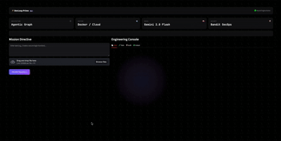

# ⚡ DevLoop: Autonomous DevSecOps Architect

[](https://devloop-4btrpio39tggj8yvpnyt2q.streamlit.app/)
[](https://opensource.org/licenses/MIT)
[](https://www.python.org/downloads/)
[](https://langchain-ai.github.io/langgraph/)

> **The "Self-Healing" Code Engine.**  
> DevLoop is an agentic AI system that autonomously writes, tests, secures, and fixes software. It replaces the "Human-in-the-Loop" with a "Security-in-the-Loop" architecture.

---

## 🎥 System Demonstration

<div align="center">
  
  <p><em>Watch the agent autonomously write code, detect failures, and self-correct in real-time.</em></p>
</div>

<br>

<div align="center">
  
**[🔴 LIVE DEMO → Access the Neural Console](https://devloop-4btrpio39tggj8yvpnyt2q.streamlit.app/)**

</div>

---

## 🚀 The Problem

Modern AI coding assistants are **"Fire and Forget"** — they generate code but leave validation to humans.

| ❌ Traditional AI Tools | ✅ DevLoop |
|:---|:---|
| Generate code blindly | **Test-Driven Development** from the start |
| No security awareness | **Bandit Security Scans** on every iteration |
| Errors require human debugging | **Self-Healing Loop** fixes its own mistakes |
| Single-shot output | **Iterative refinement** until all checks pass |

---
## 📸 Screenshots

<div align="center">

### 🖥️ Command Center Dashboard

<p><i>Cyberpunk-themed interface with real-time terminal logs and glassmorphism UI</i></p>

<br>

### 🛡️ Security Audit Report

<p><i>Automated vulnerability detection using Bandit static analysis</i></p>

</div>

---

## 🏗️ Architecture

```mermaid
graph TD
    A[👤 User Input] --> B[🏗️ Architect Agent]
    B -->|Generate Tests| C[👨‍💻 Developer Agent]
    C -->|Write Code| D[🛡️ SecOps Agent]
    D -->|Bandit Scan| E[⚡ Test Runner]
    
    E -->|❌ Tests Failed| C
    D -->|🔴 Vulnerability| C
    E -->|✅ All Passed| F[🚀 Deploy]
    
    style B fill:#1a1a2e,stroke:#00f3ff,stroke-width:2px
    style C fill:#1a1a2e,stroke:#bc13fe,stroke-width:2px
    style D fill:#1a1a2e,stroke:#ff0066,stroke-width:2px
    style F fill:#1a1a2e,stroke:#00ff88,stroke-width:2px

```



### 🔄 The Autonomous Loop

| Step | Agent | Action |
|:---:|:---|:---|
| 1️⃣ | **Architect** | Analyzes objective → Writes failing `pytest` unit tests (TDD) |
| 2️⃣ | **Developer** | Writes implementation code to pass those tests |
| 3️⃣ | **SecOps** | Scans code with `Bandit` for vulnerabilities (SQLi, Shell injection, etc.) |
| 4️⃣ | **Tester** | Executes code in **sandboxed environment** |
| 🔁 | **Self-Correction** | If tests fail OR vulnerabilities found → Loop back to Developer |

---

## 🛠️ Tech Stack


| Category | Technology |
|:---|:---|
| **Orchestration** | [LangGraph](https://langchain-ai.github.io/langgraph/) — Cyclic State Management |
| **LLM** | Google Gemini 1.5 Flash |
| **Security** | [Bandit](https://bandit.readthedocs.io/) — Static Application Security Testing |
| **Sandbox** | Docker / Local Subprocess |
| **Frontend** | Streamlit + Custom CSS/JS (Glassmorphism UI) |

</div>

---

## 📂 Project Structure

```text
Devloop/
├── .devcontainer/       # Dev container configuration
├── app.py               # 🖥️ Frontend — Streamlit dashboard with cyberpunk UI
├── logic.py             # 🧠 Brain — LangGraph state machine & agent definitions
├── tools.py             # 🔧 Tools — File I/O & sandboxed code execution
├── style.py             # 🎨 Styling — ANSI colors & CLI formatting
├── Dockerfile           # 📦 Sandbox — Isolated execution environment
├── requirements.txt     # 📋 Dependencies
├── solution.py          # 💾 Artifact — AI-generated code
├── test_solution.py     # 🧪 Artifact — AI-generated unit tests
├── demoo.gif            # 🎥 Demo animation
└── Screenshot 1..png    # 📸 Interface screenshot
```

---

## ⚡ Quick Start

### Prerequisites
- Python 3.10+
- Docker *(optional, for full sandbox isolation)*

### Installation

```bash
# 1. Clone the repository
git clone https://github.com/Ayush1Deshmukh/Devloop.git
cd Devloop

# 2. Install dependencies
pip install -r requirements.txt

# 3. Set your API key
export GOOGLE_API_KEY="your_gemini_api_key"    # Mac/Linux
# $env:GOOGLE_API_KEY="your_gemini_api_key"    # Windows PowerShell

# 4. Launch the console
streamlit run app.py
```

---

## 🧪 Test the Self-Healing

Want to see autonomous debugging in action?

1. **Upload vulnerable code** containing:

   ```python
   import subprocess

   subprocess.call(user_input, shell=True)  # Security flaw!
   ```

2. **Set objective:**  
   `"Refactor this code to be secure"`

3. **Watch DevLoop:**
   - 🛡️ SecOps detects the vulnerability
   - 👨‍💻 Developer rewrites using `subprocess.run()` with proper sanitization
   - ✅ All security checks pass automatically

---

## 🌟 Key Features

- 🔄 **Autonomous TDD** — Tests written before implementation  
- 🛡️ **Security-First** — Every iteration scanned for vulnerabilities  
- 🔁 **Self-Healing** — Reads stack traces, fixes its own bugs  
- 🐳 **Sandboxed Execution** — Safe code execution in Docker containers  
- 🎨 **Cyberpunk UI** — Immersive glassmorphism interface with terminal aesthetics  

---

## 👨‍💻 Author

<div align="center">
  
**Ayush Deshmukh**  
*Third-Year Computer Science & Engineering*

[](https://github.com/Ayush1Deshmukh)

</div>

---

<div align="center">
  
### 🚀 Built for the Future of Agentic Software Engineering

*"Code that writes, tests, and secures itself."*

---

⭐ **Star this repo** if you find it useful!

</div>
