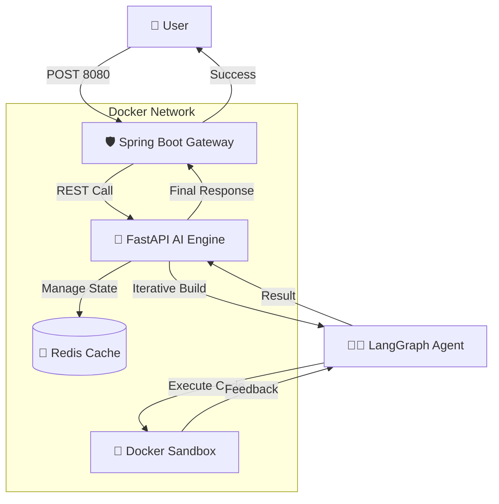

# ⚡ DevLoop: Autonomous DevSecOps Architect (Enterprise Edition)

[](https://devloop-4btrpio39tggj8yvpnyt2q.streamlit.app/)
[](https://opensource.org/licenses/MIT)
[](https://www.python.org/downloads/)
[](https://www.oracle.com/java/technologies/downloads/)
[](https://langchain-ai.github.io/langgraph/)

> **The "Self-Healing" Microservices Code Engine.**  
> DevLoop is an agentic AI system that autonomously writes, tests, secures, and fixes software. Now upgraded to a **Polyglot Microservices Architecture** for enterprise-scale reliability.

---

## 🎥 System Demonstration

<div align="center">
  
  <p><em>Watch the agent autonomously write code, detect failures, and self-correct in real-time.</em></p>
</div>

<br>

<div align="center">
  
**[🔴 LIVE DEMO → Access the Neural Console](https://devloop-4btrpio39tggj8yvpnyt2q.streamlit.app/)**

</div>

---

## 🚀 The Evolution: Why Microservices?

Modern AI systems require **Separation of Concerns**. DevLoop has evolved from a single script into a distributed system:

| 🏗️ Service | Technology | Responsibility |
|:---:|:---:|:---|
| **API Gateway** | **Spring Boot** | Enterprise ingress, request routing, and security |
| **AI Engine** | **FastAPI** | LangGraph orchestration and LLM state management |
| **Memory** | **Redis** | Persistence of agent states and rate-limiting |
| **Sandbox** | **Docker** | Isolated, secure execution of generated artifacts |
| **Neural Console** | **Streamlit** | Operator UI for launching and watching runs |

---

## 📸 Screenshots

<div align="center">

### 🖥️ Command Center Dashboard

<p><i>Cyberpunk-themed interface with real-time terminal logs and glassmorphism UI</i></p>

<br>

### 🛡️ Security Audit Report

<p><i>Automated vulnerability detection using Bandit static analysis</i></p>

</div>

---

## 🏗️ System Architecture


```mermaid
graph TD
    User[👤 User] -->|POST 8080| GW[🛡️ Spring Boot Gateway]
    GW -->|REST Call| API[🧠 FastAPI AI Engine]
    API -->|Manage State| Redis[(💾 Redis Cache)]
    API -->|Iterative Build| Agent[👨‍💻 LangGraph Agent]
    Agent -->|Execute Code| Box[🐳 Docker Sandbox]
    
    Box -->|Feedback| Agent
    Agent -->|Result| API
    API -->|Final Response| GW
    GW -->|Success| User

    subgraph "Docker Network"
    GW
    API
    Redis
    Box
    end
```

---

## 🔄 The Autonomous Self-Healing Loop

| Step | Agent | Action |
|------|-------|--------|
| 1️⃣ | Architect | Analyzes objective → Writes failing pytest unit tests (TDD) |
| 2️⃣ | Developer | Writes implementation code to pass those tests |
| 3️⃣ | SecOps | Scans code with Bandit for vulnerabilities (SQLi, Shell injection, etc.) |
| 4️⃣ | Tester | Executes code in sandboxed environment |
| 🔁 | Self-Correction | If tests fail OR vulnerabilities found → Loop back to Developer |

---

## 🛠️ Tech Stack

| Category | Technology |
|----------|------------|
| Orchestration | LangGraph — Cyclic State Management |
| Backend (Gateway) | Java 17, Spring Boot 3.x |
| Backend (AI) | Python 3.11, FastAPI |
| LLM | Google Gemini 2.0 Flash (2.5 Flash as quota fallback) |
| Infrastructure | Docker, Docker Compose, Redis |
| Frontend | Streamlit + Custom Glassmorphism UI |

---

## 📂 Project Structure

```plaintext
DevLoop/
├── src/main/java/       # 🛡️ Gateway — Spring Boot Java Source
├── app/                 # 🧠 AI Engine — Python FastAPI Source
│   ├── core/agents/     # LangGraph node definitions
│   ├── api/routes/      # Endpoint logic
│   └── main.py          # FastAPI Entry Point
├── docker/              # 📦 Infrastructure — Dockerfiles for Java/Python/Sandbox
├── docker-compose.yml   # 🕸️ Orchestrator — Multi-container networking
├── pom.xml              # 📋 Maven Dependencies
├── requirements.txt     # 📋 Python Dependencies
├── .env.example         # 🔑 Secret Configuration Template
└── README.md            # 📖 Documentation
```

---

## ⚡ Quick Start

### 0️⃣ Get a Gemini API key

Create one at **[aistudio.google.com/app/apikey](https://aistudio.google.com/app/apikey)**, then:

```bash
cp .env.example .env     # then add your GOOGLE_API_KEY
```

> **Check your key before your first run.** Launch the UI and press
> **🩺 Test this key** in the sidebar. It calls Google's ListModels endpoint and
> tells you exactly what is wrong — suspended key, invalid key, disabled API, or
> a retired model name — instead of failing halfway through a run. It also prints
> every model your key can actually use, which is what `LLM_MODEL` must be set to.

---

### 1️⃣ Run the UI only (no Docker — fastest path)

This is all you need to see the agent work. Generated code runs in the rlimit
sandbox rather than a container.

```bash
python -m venv venv && source venv/bin/activate
pip install -r requirements.txt
streamlit run app.py
```

Open **http://localhost:8501**.

---

### 2️⃣ Or run the full stack (Docker sandbox + Gateway + Redis)


Deploy the entire 5-container stack (gateway, engine, UI, Redis, sandbox)
with a single command. The gateway jar is built inside its image, so you do
not need Maven installed:

```bash
docker compose up --build -d
```

---

### 3️⃣ Access the full stack

- Gateway API: http://localhost:8080/api/v1/agent/execute  
- Neural Console (UI): http://localhost:8501  
- Engine docs: http://localhost:8000/docs  

---

## ☁️ Deploying for Free

Full step-by-step guide: **[DEPLOYMENT.md](DEPLOYMENT.md)**

| Component | Free host |
|---|---|
| Neural Console | Streamlit Community Cloud |
| AI Engine | Hugging Face Spaces / Render |
| Gateway | Render (`render.yaml` blueprint included) |
| Redis | Upstash |

> **One honest caveat:** the Docker sandbox is *local-only*. No free host mounts
> `/var/run/docker.sock`, so a deployed instance automatically falls back to an
> OS-level sandbox — throwaway temp dir, CPU/memory/process/file-size rlimits,
> wall-clock timeout, and an environment scrubbed of your API key. Strong, but
> not kernel-namespace isolation. Details in [DEPLOYMENT.md](DEPLOYMENT.md).

The public demo gives each visitor a few free runs on the maintainer's key, then
invites them to paste their own — so the demo stays live regardless of traffic.

---

## 🌟 Key Features

- 🏗️ **Polyglot Architecture** — Java stability for ingress, Python flexibility for AI.  
- 🔄 **Autonomous TDD** — Tests written before implementation.  
- 🛡️ **Security-First** — Every iteration scanned for vulnerabilities using Bandit.  
- 🔁 **Self-Healing** — Reads stack traces, fixes its own bugs in real-time.  
- 🐳 **Sandboxed Execution** — High-security code execution in isolated containers.  

---

## 🧯 Troubleshooting

| Symptom | Cause | Fix |
|---|---|---|
| `Sequence aborted` immediately, log says the key is **suspended** | Google suspended that key's project. It cannot be revived. | Create a fresh key, ideally in a **new** Cloud project. |
| `Sequence aborted`, log says the model was rejected | `LLM_MODEL` names a retired model (e.g. any `gemini-1.5-*`). | Press **🩺 Test this key** to list usable models; set `LLM_MODEL` to one of them. |
| Sidebar shows `SANDBOX rlimit` instead of `Docker` | The `devloop-sandbox` container isn't running. | `docker compose up -d`, or accept rlimit isolation for local use. |
| Security tab always says "Scanner unavailable" | Bandit isn't installed in the interpreter running the app. | `pip install -r requirements.txt` inside the same venv you launch Streamlit from. |

---

## 👨‍💻 Author

<div align="center">

**Ayush Deshmukh**  
Third-Year Computer Science & Engineering  

</div>

---

<div align="center">

🚀 Built for the Future of Agentic Software Engineering  

⭐ Star this repo if you find it useful!

</div>
