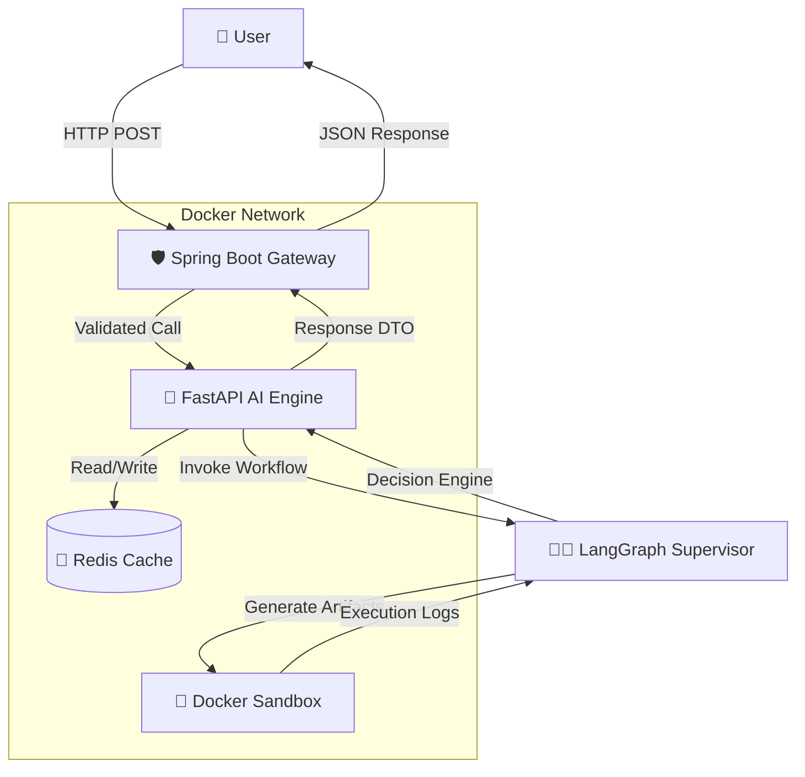

<div align="center">

#  ⚡ DevLoop: Autonomous DevSecOps Architect 

<br><br>
</div>

[](https://devloop-4btrpio39tggj8yvpnyt2q.streamlit.app/)
[](https://opensource.org/licenses/MIT)
[](https://www.python.org/downloads/)
[](https://www.oracle.com/java/technologies/downloads/)
[](https://langchain-ai.github.io/langgraph/)

> **The Self-Healing Microservices Code Engine**  
> DevLoop is a distributed, agentic AI platform that autonomously **architects, writes, tests, secures, executes, and repairs software** in a continuous feedback loop.  
> Designed as a **Polyglot, Enterprise-Ready Microservices Platform** built for scalability, fault isolation, and production resilience.

---

# 🎯 Vision

DevLoop represents the next evolution of software engineering:

- ✅ AI-Driven Test-First Development  
- ✅ Autonomous Secure Coding & Static Analysis  
- ✅ Self-Debugging via Stack Trace Reasoning  
- ✅ Ephemeral, Containerized Execution  
- ✅ Distributed Microservices Architecture  

DevLoop doesn’t just generate code — it **reasons in cycles**, evaluates failure states, and iteratively improves until convergence.

---

# 🎥 System Demonstration

<div align="center">
  
  <p><em>Observe DevLoop generating tests, implementing logic, detecting runtime failures, scanning for vulnerabilities, and autonomously correcting errors — until all criteria pass.</em></p>
</div>

<br>

<div align="center">

### 🔴 **[LIVE DEMO → Access the Neural Console](https://devloop-4btrpio39tggj8yvpnyt2q.streamlit.app/)**

</div>

---
---

# 📸 Interface Preview

<div align="center">

## 🖥️ Backend Interface (AI Engine + Gateway)


<p><em>
Backend service monitoring view showing:
<br>• API request handling (Spring Boot Gateway)
<br>• LangGraph workflow execution logs
<br>• Redis state interactions
<br>• Sandbox execution output streams
<br>• Iteration loop tracking
</em></p>

<br>
<br>

## 🎨 Frontend Interface (Neural Console)


<br><br>


<p><em>
Cyberpunk-themed Neural Console built with Streamlit:
<br>• Real-time agent reasoning logs
<br>• Generated code viewer
<br>• Test results & coverage reports
<br>• Security vulnerability dashboard
<br>• Loop iteration counter & status tracker
</em></p>

</div>

---
# 🚀 Why Microservices? Architectural Evolution

The original monolithic design limited scalability and fault isolation.  
DevLoop evolved into a distributed architecture to achieve:

### ✅ Separation of Concerns  
Each service owns a clearly defined responsibility.

### ✅ Fault Isolation  
Sandbox crashes never impact orchestration or ingress.

### ✅ Horizontal Scalability  
AI Engine instances scale independently.

### ✅ Security Hardening  
Generated code never executes in orchestration containers.

---

# 🏗️ Service Overview

| 🏗️ Service | Technology | Responsibility | Why It Matters |
|------------|------------|---------------|----------------|
| **API Gateway** | Spring Boot 3.x (Java 17) | Authentication, routing, validation, ingress control | Enterprise-grade reliability |
| **AI Engine** | FastAPI (Python 3.11) | LangGraph orchestration & LLM workflows | Async + AI ecosystem flexibility |
| **Memory Layer** | Redis | Agent state persistence & caching | Enables cyclic reasoning |
| **Execution Sandbox** | Docker | Secure artifact execution | Zero-trust isolation |

---

# 🏗️ Deep System Architecture


```mermaid
graph TD
    User[👤 User] --->|HTTP POST| GW[🛡️ Spring Boot Gateway]
    GW -->|Validated Call| API[🧠 FastAPI AI Engine]
    API -->|Read/Write| Redis[(💾 Redis Cache)]
    API -->|Invoke Workflow| Agent[👨‍💻 LangGraph Supervisor]
    Agent -->|Generate Artifacts| Box[🐳 Docker Sandbox]
    
    Box -->|Execution Logs| Agent
    Agent -->|Decision Engine| API
    API -->|Response DTO| GW
    GW -->|JSON Response| User

    subgraph Docker Network
    GW
    API
    Redis
    Box
    end
```

---

# 🔄 The Autonomous Self-Healing Loop

| Step | Agent | Technical Action |
|------|--------|-----------------|
| 1️⃣ | Architect | Converts objective → Generates failing `pytest` tests (TDD) |
| 2️⃣ | Developer | Writes implementation code to satisfy tests |
| 3️⃣ | SecOps | Runs static analysis (Bandit / SpotBugs) |
| 4️⃣ | Tester | Executes in sandbox & captures runtime logs |
| 🔁 | Supervisor | Analyzes outputs → Loops until all checks pass |

Loop termination criteria:

- ✅ All tests pass  
- ✅ No vulnerabilities detected  
- ✅ Clean execution logs  
- ✅ Iteration limit not exceeded  

---

# 🧠 LangGraph Orchestration Model

DevLoop leverages **LangGraph’s cyclic state machine model**:

- Each agent = Node  
- Conditional edges = State transitions  
- Redis-backed shared memory  
- Deterministic multi-agent reasoning  

This enables structured reasoning beyond single-shot prompting.

---

# 🛠️ Tech Stack

| Category | Technology |
|----------|------------|
| Orchestration | LangGraph |
| Gateway | Java 17, Spring Boot 3.x, Spring Security |
| AI Engine | Python 3.11, FastAPI, Uvicorn |
| LLM | Google Gemini 1.5 Flash |
| Infrastructure | Docker, Docker Compose |
| Cache | Redis |
| Security | Bandit, SpotBugs |
| Testing | pytest, Coverage.py |
| Frontend | Streamlit |

---

# 📂 Project Structure

```plaintext
DevLoop/
│
├── src/main/java/                 # Spring Boot Gateway
├── app/                           # FastAPI AI Engine
│   ├── core/agents/               # Architect, Developer, SecOps, Tester
│   ├── core/workflow/             # LangGraph Orchestration
│   ├── sandbox/                   # Docker Execution Layer
│   └── main.py                    # FastAPI Entry
│
├── docker/                        # Dockerfiles
├── docker-compose.yml             # Multi-container network
├── pom.xml                        # Maven configuration
├── requirements.txt               # Python dependencies
└── .env.example                   # Secrets template
```

---

# ⚡ Quick Start (Enterprise Deployment)

## ✅ Prerequisites

- Docker & Docker Compose  
- Java 17  
- Maven  
- Google Gemini API Key  

---

## 🔑 Configure Secrets

```bash
cp .env.example .env
```

Edit `.env`:

```bash
GOOGLE_API_KEY="your_api_key_here"
MAX_LOOP_ITERATIONS=5
REDIS_HOST=redis
REDIS_PORT=6379
```

⚠️ Never commit `.env` to version control.

---

## 🏗️ Build Java Gateway

```bash
docker run --rm \
  -v "$(pwd)":/app \
  -w /app \
  maven:3.9.6-eclipse-temurin-17 \
  mvn clean package -DskipTests
```

---

## 🚀 Launch Microservices

```bash
docker-compose up --build -d
```

Verify:

```bash
docker-compose ps
```

---

## 🌐 Access the Platform

**API Endpoint**  
POST → `http://localhost:8080/api/v1/agent/execute`

**Neural Console UI**  
http://localhost:8501

---

# 🔐 Security Model

- 🔒 No generated code executes on host machine  
- 🐳 Ephemeral container execution  
- 🛡️ Static security scanning before runtime  
- 📊 Resource limits (CPU / Memory quotas)  
- 🚦 Rate limiting via Redis  
- 🔁 Iteration cap prevents infinite loops  

---

# 🌟 Enterprise Features

- 🏗️ Polyglot Microservices Architecture  
- 🔄 Autonomous Test-Driven Development  
- 🛡️ Continuous Static Security Analysis  
- 🔁 Self-Healing Debug Loop  
- 🐳 Sandboxed Zero-Trust Execution  
- 💾 Stateful Agent Memory  
- ⚡ Horizontally Scalable AI Engine  

---

# 📈 Roadmap

- Kubernetes Deployment  
- Prometheus + Grafana Observability  
- CI/CD Pipeline Integration  
- Multi-LLM Support  
- OAuth2 / JWT Authentication  

---

# 👨‍💻 Author

<div align="center">

**Ayush Deshmukh**  
Computer Science & Engineering  

Passionate about AI, DevSecOps & Autonomous Systems  

🔗 GitHub: https://github.com/ayushdeshmukh  
🔗 LinkedIn: https://linkedin.com/in/ayushdeshmukh  

</div>

---

<div align="center">

🚀 Building the Future of Autonomous Software Engineering  

⭐ Star this repository if DevLoop accelerates your workflow  

</div>
